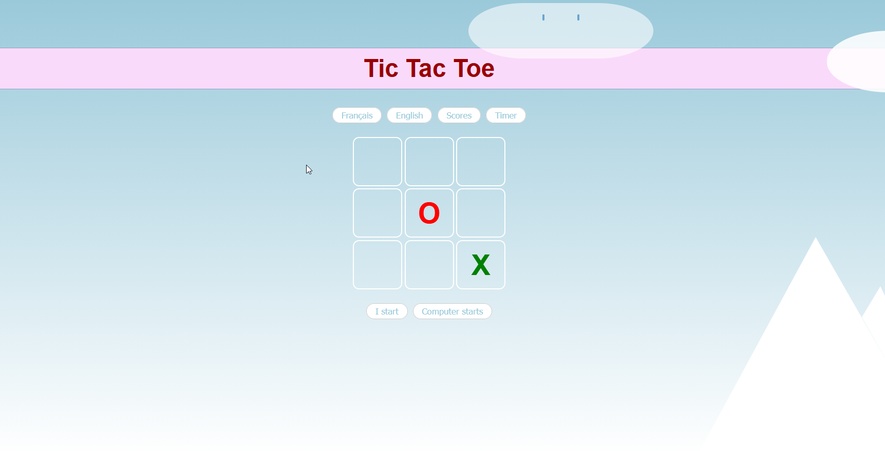

# 🎮 Tic-Tac-Toe Minimax

An unbeatable Tic-Tac-Toe game powered by the **Minimax algorithm**, built with vanilla HTML, CSS & JavaScript.

> 🇫🇷 Interface disponible en français et en anglais.


---

## 📸 Screenshot




---

## ✨ Features

- 🤖 **Unbeatable AI** — powered by the Minimax algorithm, the computer never loses
- 🌍 **Bilingual interface** — switch between French and English
- 📊 **Score tracking** — wins, losses and draws are counted
- ⏱️ **Play timer** — track how long you've been playing
- 🎨 **Animated scenery** — clouds, sun, star and mountain in pure CSS
- 📱 **Responsive design** — playable on desktop and mobile

---

## 🧠 How Minimax Works

The Minimax algorithm recursively explores **every possible future move** and assigns a score to each outcome:

| Outcome | Score |
|---|---|
| AI wins | `+10 - depth` |
| Human wins | `depth - 10` |
| Draw | `0` |

The AI (**maximizer**) picks the move with the **highest** score, while assuming the human (**minimizer**) will always pick the move with the **lowest** score.
```
                      AI chooses (MAX)
                   /        |        \
               Move A    Move B    Move C
                 |          |         |
              Human       Human    AI WINS!
              (MIN)       (MIN)    Score:+10
             /    \       /    \
           ...    ...   ...    ...
          Score  Score  Score  Score

  Scores bubble up: MIN picks lowest, MAX picks highest.
```

Since Tic-Tac-Toe has a small search space (≤ 362,880 nodes), the algorithm runs **instantly** and guarantees **perfect play**.

> With two perfect players, Tic-Tac-Toe always ends in a draw. With Minimax, the AI **never loses**.

---

## 📁 Project Structure
```
tic-tac-toe-minimax/
├── index.html      # Game page (grid, controls, decorative elements)
├── style.css       # Styling, animations, responsive layout
├── game.js         # Game logic, Minimax AI, score &amp; timer
├── img/
│   └── screenshot.png
└── README.md
```

---

## 🚀 Getting Started

### Play Online

👉 **[Play the game here](https://oliver791.github.io/tic-tac-toe-minimax/)**

### Run Locally

```bash
git clone https://github.com/oliver791/tic-tac-toe-minimax.git
cd tic-tac-toe-minimax
open index.html


---

## 🕹️ How to Play

1. Click **"Je commence"** / **"I start"** to play first (you are `O` in red)
2. Click **"L'ordinateur commence"** / **"Computer starts"** to let the AI go first (`X` in green)
3. Click any empty cell to place your mark
4. Try to align 3 symbols in a row, column, or diagonal
5. Use the **Scores** button to toggle the scoreboard
6. Use the **Timer** button to toggle the play timer
7. Switch language anytime with **Français** / **English**

> ⚠️ Spoiler: the AI is unbeatable. The best you can achieve is a draw!

---

## 🛠️ Technologies

- **HTML5** — semantic structure
- **CSS3** — grid layout, animations, responsive design, pure CSS art (clouds, sun, mountain)
- **Vanilla JavaScript** — game logic, Minimax AI, DOM manipulation
- No frameworks, no libraries, no dependencies

---

## 📖 What I Learned

- Implementing the **Minimax algorithm** for game AI
- Recursive thinking and tree-based decision making
- CSS animations and pure CSS decorative elements
- Responsive web design with `@media` queries
- Clean separation of HTML / CSS / JS

---

## 📝 License

This project is open source and available under the [MIT License](LICENSE).

---

<p align="center">
  Made with ❤️ and a lot of ☕ by oliver791
</p>
